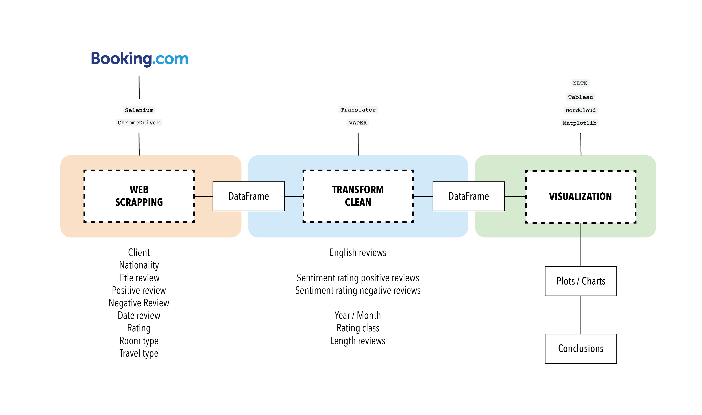

# Sentiment analysis extracted from booking reviews

## Table of Contents

- [Project Description](#project-description)
- [Database](#database)
- [Workflow](#workflow)
- [Organization](#organization)
- [Next steps](#conclusions)
- [Links](#links)

## Project Description
In today's digital world, the power of online reviews cannot be underestimated. Users now have the ability to openly share their opinions and experiences and this information has become a valuable resource for both consumers and businesses alike. Whether choosing a restaurant, buying a product or booking a hotel, the opinions of others play an important role in guiding our choices and preferences. It is essential for companies to carefully analyze user sentiments, as this allows them to understand customer preferences and make the necessary adaptations to meet their expectations.

## Database
To obtain the data, Booking has been scrapped with a driver. Almost 900 reviews were collected for the Prisma EXE hotel in Andorra, spanning from 2020 to 2023. Various details were extracted, including customer nick name, nationality, positive and negative reviews, review dates, ratings, room types, and trip types.

## Workflow
First of all, all the reviews of the selected hotel for the analysis have been scrapped. This was made by using ChromeDriver and Selenium, a library to perform automated test cases for browsers or web applications. 

The next step have been to translate the opinions into English using the Translator library. In this way, the sentiments could then be extracted using Vader, a library that processes text to find out the polarity: positive, negative or neutral. At the same time, other columns of interest have been created and null or incorrect values have been removed.

Finally, the resulting data have been analyzed and several charts have been made using libraries such as matplotlib, WordCloud and Tableau software.

## Organization
<u>Notebooks</u>
 * __Data Extracting__: Implementation of the driver to scrap Booking and extract the data in a .csv file.
 * __Data Transformation__: Transformation and cleaning of the data. 
* __Data Visualization__: Visualization of some plots for the final results. Other results are available in the Tableau link at the end of this document.

<u>Data</u>
 * __Scrapping Booking Prisma__: .csv file resulting from scrapping.
 * __Prisma Def__: .csv file resulting from the transformation and cleaning of the data.

<u>Figures</u>
* Plots resulting from the data analysis are included.

<u>Images</u>
* Complementary images for project documentation are included.

## Next steps

Modularize the functions of the notebooks into a main.py file.

Perform queries on the data retrieved.

Modification of the graphics to find more meaningful patterns and visualizations

Conclusions and analysis of plots.

## Links
[EXE Prisma hotel - Booking](https://www.booking.com/hotel/ad/hotel-exe-prisma.es.html)

 [Tableau report](https://public.tableau.com/app/profile/bego.ripoll/viz/AnalysisofEXEPrismaHotelAndorrabookingreviews/Story1?publish=yes)

[NTKL](https://www.nltk.org/)

[VADER](https://pypi.org/project/vaderSentiment/)
